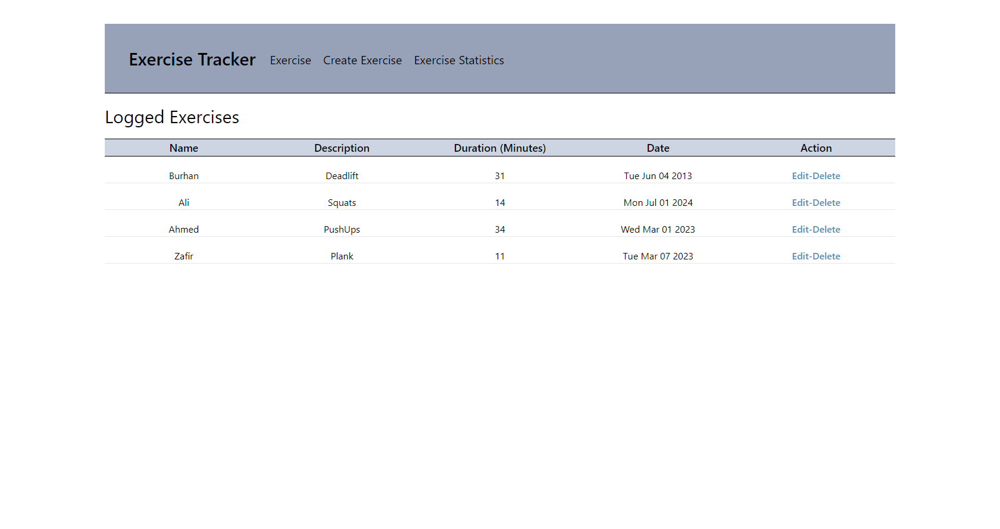

# Express-Project
A Backend Project that I did as an Internship task at Bytewise

## Languages and Tools
- Express
- NodeJs
- MongoDB
- EJS (for FrontEnd)
- Tailwind
- Nodemon

### Apply Tailwind in your Project via CDN  
``

### Features in Application
- View All Data
- Add new Log
- Delete any Log
- Edit any Log
- Statistical Anaylsis on the basis of Exercise duration

## Points to Ponder(MongoDB)
- Make sure to use the name of Database when connecting locally instead of collection name
- Syntax to connect your defined Schema   `mongoose.model('AnyName', Schema);`